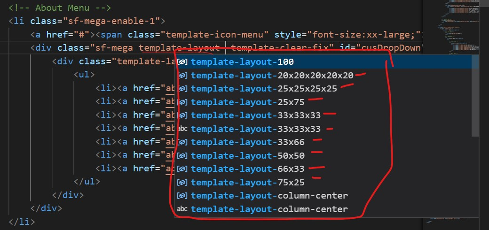
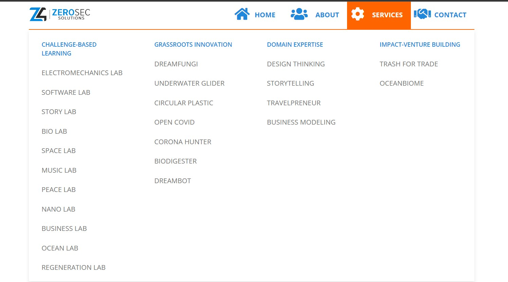

# Mega Navbar Template

## Introduction

Mega Navbar is a multi-section big dropdown menu, if we need to extend the depth of the menu by adding submenus to some of the items we could consider using a nested dropdown.

## Classes

- **template-layout-100** :Single section
- **template-layout-25x75**: for 2 section by 25x 77
- **template-layout-33x66**: for 2 section by 33x66
- **template-layout-50x50**: for 2 section by 50x50
- **template-layout-75x25**: for 2 section by 75x25
- **template-layout-33x33x33**: for 3 section by 33x33x33
- **template-layout-25x25x25x25**: for 4 section by 25x25x25x25
- **template-layout-20x20x20x20x20**: for 5 section by 20x20x20x20x20

### template-layout-25x25x25x25 (Example)

