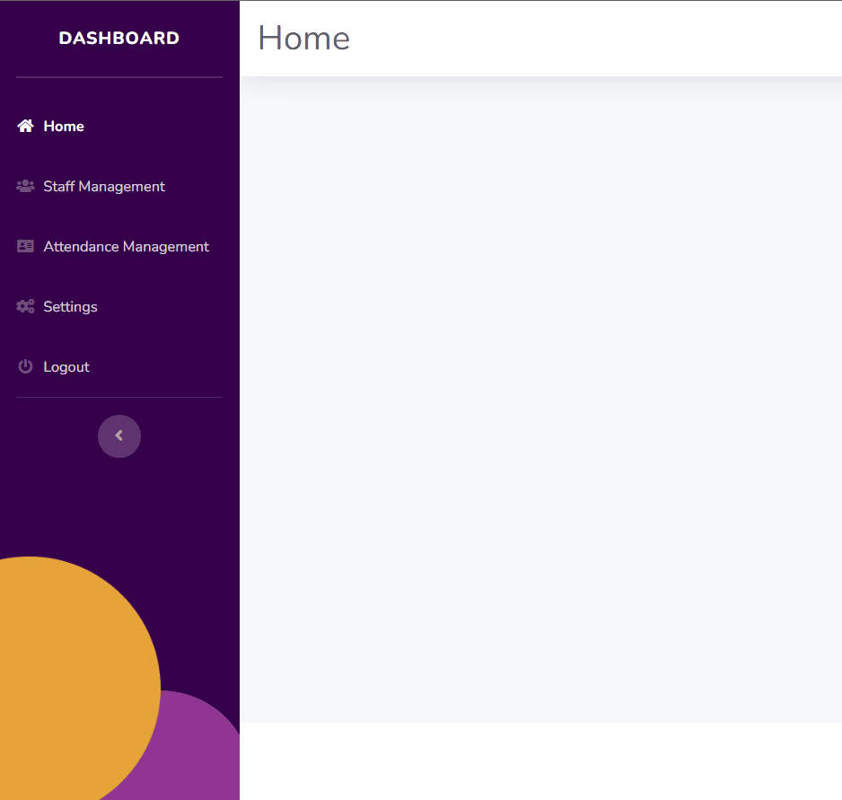

# Mega Navbar Template

## Introduction

The toggleable navbar is an essential component of any modern website, providing easy navigation for users to access various sections of the website. Developed using HTML, CSS and Bootstrap, this type of navbar is designed to collapse and expand based on user interaction, allowing for a more streamlined and user-friendly experience on both desktop and mobile devices. With a toggleable navbar, website visitors can easily navigate through the website without having to scroll or search for the information they need.

