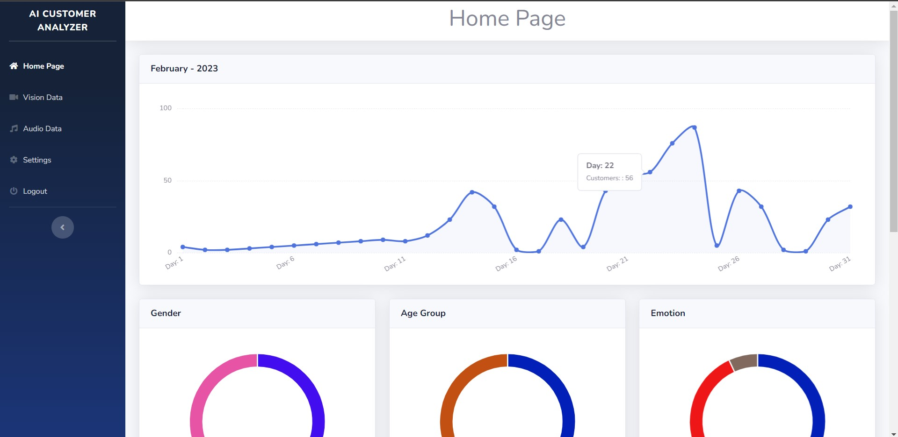
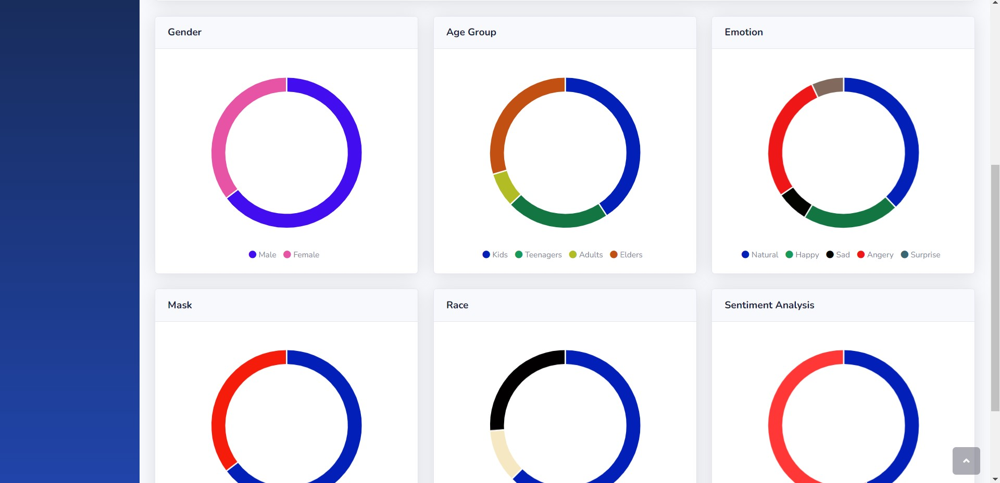
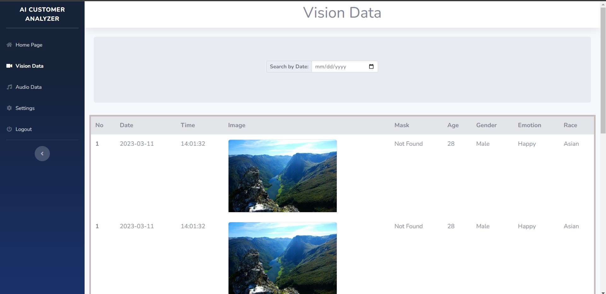
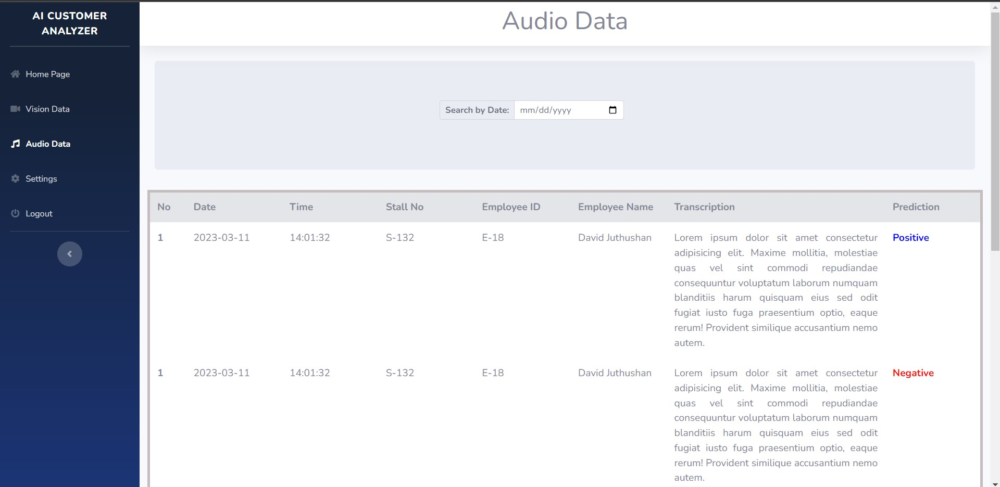
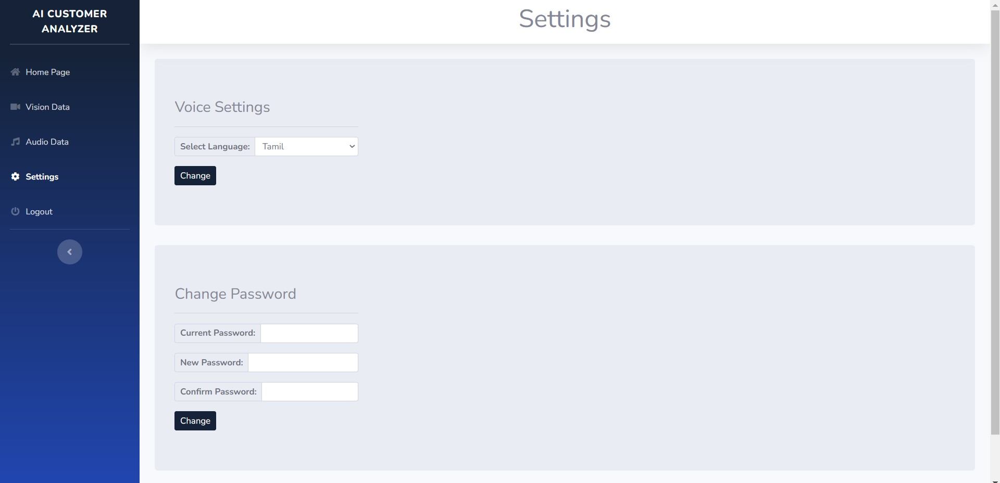

# Dashboard Template AI Customer Analyzer

## Introduction

The customer analyzer platform dashboard template is a modern, responsive dashboard built with HTML, CSS, and other front-end frameworks. It has been specifically designed to help businesses gain valuable insights into their customers and make data-driven decisions that will drive business growth and success.

The dashboard template features a wide range of pi-charts and other matrix charts that provide a visual representation of key customer metrics.

In addition to the charts, the dashboard template also includes tables that allow users to dive deeper into the data and extract specific insights. The tables are highly customizable and can be filtered and sorted to display the data in a way that is most relevant to the user.

The dashboard template is fully responsive and can be accessed on any device, including desktops, laptops, tablets, and smartphones. It has been optimized for fast loading times and is highly customizable, allowing businesses to tailor the dashboard to their unique needs.

Other features of the dashboard template include a user-friendly interface, easy-to-use navigation, and support for multiple users. It also comes with detailed documentation and support, making it easy for businesses to get up and running with the dashboard quickly and efficiently.

### Login Page

### Home Page

### Vision Date Page

### Audio Date Page

### Audio Date Page

