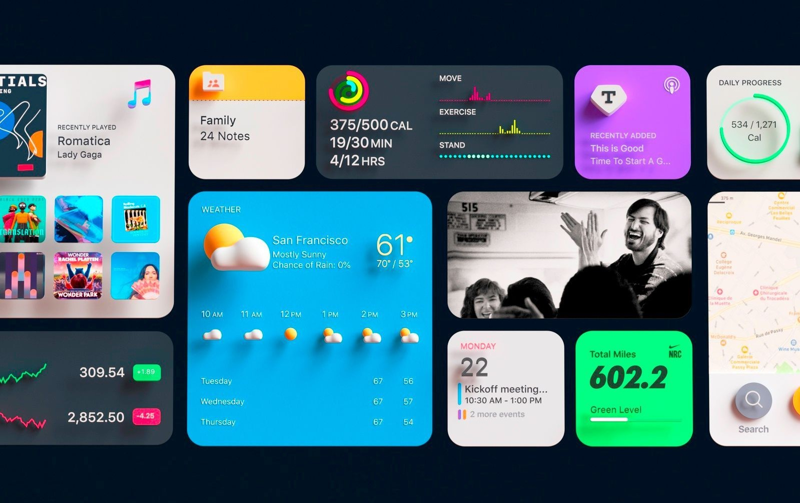

# Frontend Website Widgets Templates

## Introduction

This repository contains a collection of website custom templates and widgets snippet codes for frontend website development such as home page, sliders, navbars etc.

This widget snippet could be easily copied and used for frontend development purposes, it makes developers' life easier by providing built-in widget components for frontend developments.

## Widgets Templates

1. [Maga Navbar Template](0-mega-navbar-template/)
2. [Dashboard Toggleable Sidebar Template](1-dashboard-toggleable-sidebar)
3. [Dashboard Template AI Customer Analyzer](2-dashboard-template-ai-customer-analyzer)

## Social Links

## Social Links

- [Linkedin](https://www.linkedin.com/in/gunarakulangunaretnam)
- [Facebook](https://www.facebook.com/gunarakulangunaretnam)
- [Instagram](https://www.instagram.com/gunarakulangunaretnam)
- [Twitter](https://twitter.com/gunarakulangr)
- [Kaggle](https://www.kaggle.com/gunarakulangr)
- [TikTok](https://www.tiktok.com/@gunarakulangunaretnam)
- [Youtube](https://www.youtube.com/channel/UCjMOdgHFAjAdBKiqV8y2Tww)
